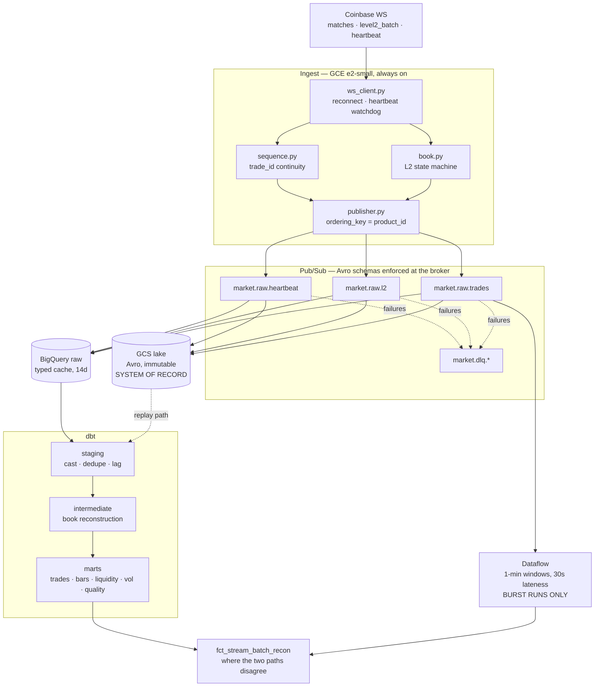

# Architecture

## Component responsibilities

| Component | Owns | Explicitly does not |
|---|---|---|
| **Consumer** | Connection lifecycle, book state, gap detection, publishing | Any transformation — parsing beyond field extraction belongs in dbt, where it is tested and reproducible |
| **Pub/Sub** | Durable buffer, schema enforcement, fan-out | Ordering across products (only per `ordering_key`) |
| **GCS lake** | The system of record, byte-for-byte | Being queryable quickly — that is the warehouse's job |
| **BigQuery raw** | Fast querying of recent data | Being authoritative; it expires and is rebuildable |
| **dbt** | All transformation logic | Ingestion or scheduling |
| **Dagster** | Scheduling, lineage, freshness sensing | Transformation logic — it invokes dbt, it does not reimplement it |
| **Dataflow** | Streaming aggregation for reconciliation | The ingest path (ADR 0002) |

## The three properties everything else serves

**1. Raw is immutable; everything else is a pure function of it.**
Fix a bug in a formula, re-run, done — no re-fetching, because the truth is
still in the lake. A system that transforms on write turns a bug into permanent
data loss.

**2. Loss is measurable, not assumed.**
`trade_id` is contiguous per product, so completeness is arithmetic rather than
a guess. `fct_data_quality` publishes it hourly and the SLA is tested.

**3. Reruns are idempotent.**
`insert_overwrite` on the date partition means running a model once or ten
times produces the same table. Retries, backfills and overlapping schedules
all happen.
